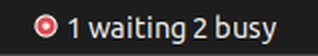
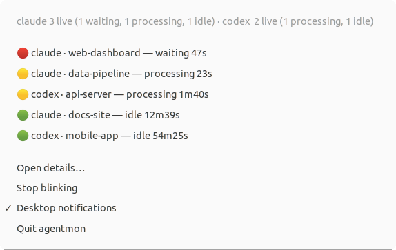
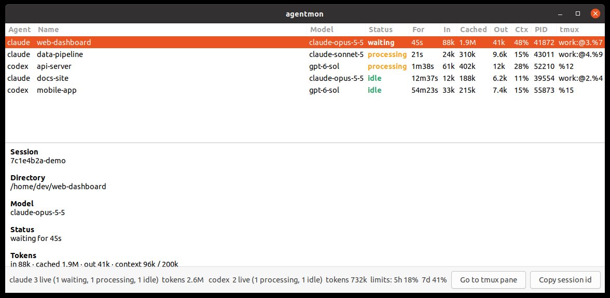
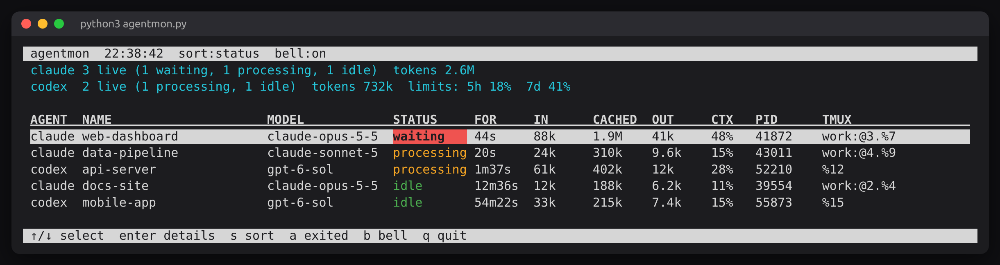

# agentmon

agentmon 在 Windows 通知区域、Ubuntu 顶栏或 macOS 菜单栏中显示
**Claude Code** 和 **Codex** 的运行状态，并可同时监控：

- 本机 Agent
- Windows 上的 WSL Agent
- SSH 远程服务器上的 Agent

它会显示处理中、等待确认、空闲和已退出等状态，并在需要确认或任务完成时闪烁图标；Windows 和 Ubuntu 还会发送系统通知。

## 下载

从 [GitHub Releases](https://github.com/jacques7zhu/agent_monitor/releases/latest)
下载适合当前系统的安装包。本机不需要手动配置 Python；Ubuntu 安装包所需的
系统依赖会由软件包管理器自动安装。

| 系统 | 推荐下载 | 其他版本 |
|---|---|---|
| Windows x64 | `agentmon-setup.exe` | `agentmon-tray.exe` 便携版 |
| Ubuntu x86_64 | `agentmon_VERSION_amd64.deb` | `agentmon-linux-x86_64` 终端版 |
| macOS Apple Silicon | `agentmon-macos-arm64.dmg` | `agentmon-macos-arm64` 终端版 |
| macOS Intel | `agentmon-macos-x86_64.dmg` | `agentmon-macos-x86_64` 终端版 |

## 安装

### Windows

1. 下载并运行 `agentmon-setup.exe`。
2. 安装时可选择“登录时启动”。
3. 启动后，agentmon 图标会出现在右下角通知区域；如果没有看到，请检查 `^` 折叠菜单。

没有配置文件时，Windows 版本默认监控 WSL 的默认发行版。便携版
`agentmon-tray.exe` 可直接双击运行。

Windows SmartScreen 可能提示“未知发布者”，这是因为当前安装包尚未使用商业证书签名。

### Ubuntu

下载 `.deb` 后安装：

```sh
sudo apt install ./agentmon_VERSION_amd64.deb
```

安装完成后，从应用列表打开 **agentmon**。如需登录时自动启动，可在 Ubuntu
“启动应用程序”中添加命令 `agentmon-tray`。

### macOS

1. Apple Silicon 下载 `agentmon-macos-arm64.dmg`，Intel Mac 下载
   `agentmon-macos-x86_64.dmg`。
2. 打开 DMG，将 `agentmon.app` 拖入 **Applications**。
3. 启动后可在菜单栏中打开 **Start at Login**。

当前应用经过临时签名但尚未公证。首次启动若被 macOS 拦截，请按住 Control
点击应用，选择 **打开** 并确认。

## 配置监控目标

Windows 默认监控 WSL；Ubuntu 和 macOS 默认监控本机。需要同时监控多个目标时，
创建以下配置文件：

- Windows：`%APPDATA%\agentmon\targets.json`
- Ubuntu / macOS：`~/.config/agentmon/targets.json`

示例：

```json
{
  "targets": [
    "local",
    "wsl:Ubuntu-24.04",
    "ssh:build"
  ]
}
```

支持的目标：

- `local`：当前操作系统
- `wsl`：默认 WSL 发行版，仅 Windows
- `wsl:Ubuntu-24.04`：指定 WSL 发行版
- `ssh:build`：`~/.ssh/config` 中名为 `build` 的远程服务器
- `ssh:user@example.com`：直接指定 SSH 用户和主机

修改配置后请退出并重新启动 agentmon。

SSH 目标需要提前配置密钥登录，远程服务器需要提供 `python3`。agentmon
通过系统自带的 SSH 客户端连接，不需要在远程服务器安装服务或开放额外端口。
某个远程目标不可用时，不会影响其他目标。

## 状态说明

| 图标 | 状态 | 含义 |
|---|---|---|
| 🔴 红色 | waiting | Agent 正在等待确认或授权 |
| 🟠/🟡 橙色或黄色 | waiting? | 根据活动推测可能正在等待 |
| 🟡 黄色 | processing | Agent 正在处理任务 |
| 🟢 绿色 | idle | Agent 已完成并处于空闲状态 |
| ⚪ 灰色 | no agents | 没有运行中的 Agent |

单击或右键图标可以查看会话、工作目录、模型、Token 用量以及最近的提示和回复。
需要确认、任务完成或运行中的会话退出时，图标会闪烁；Windows 和 Ubuntu
还会发送系统通知。

Windows 版右键菜单提供 **Test notification and blinking**。如果测试时图标会闪烁
但没有系统通知，请检查：

- **设置 → 系统 → 通知** 中是否允许 agentmon 通知
- Windows **请勿打扰** 是否已开启
- 图标是否仍位于右下角的 `^` 折叠菜单中

## 界面

<p>
  <br>
  
</p>




